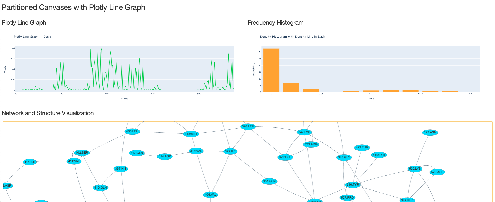

# How to run dashboard-with-network:
  
  
## This walkthrough assumes basic:
  <ul>Command-line efficiency </ul>
  <ul>Python skills</ul>
Cloning the repository is fairly straightforward. Navigate to the PlotlyDashApps repository, select the green 'Code' button as shown below, and copy the link in the drop down menu. 
  

  
Next, open a terminal on your Desktop and type the command `shell git clone git@github.com:LastCodeBender42/PlotlyDashApps.git`.
This will automatically create a PlotlyDashApps folder on your Desktop. This is a clone of the repository on GitHub. As a precaution to protect the system-wide Python dependencies of the user it is recommended that a Python virtual environment be installed to effectively isolate the project.
  

Next, navigate to the dashboard-with-network directory. And run the the command `python app.py`. 

If all Python dependencies are installed, then the program will execute and the terminal sThen it is recommended that a Python virtual environment be installed before proceeding.

