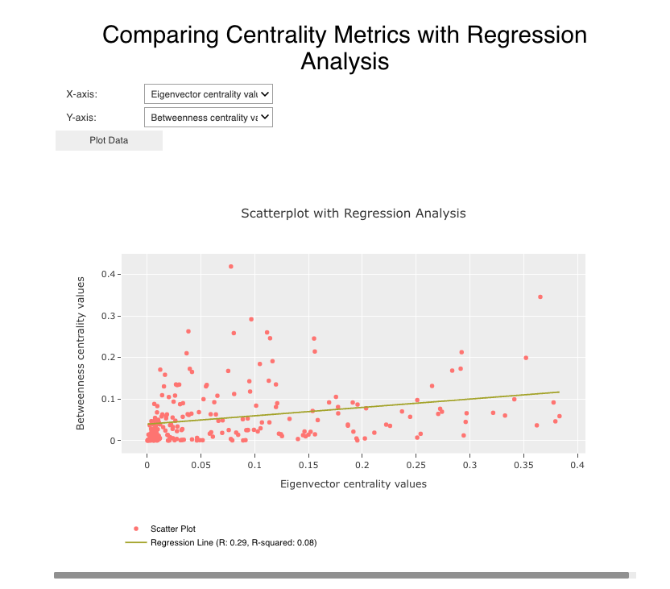
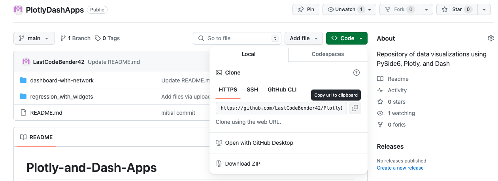
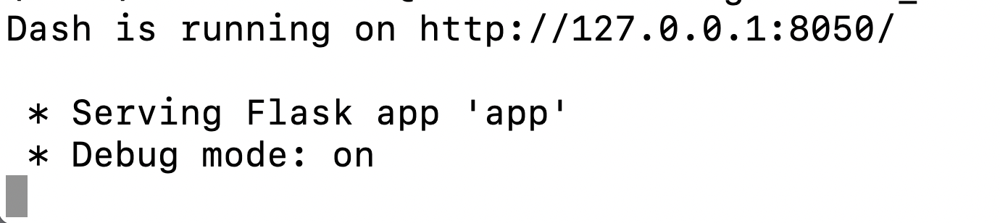

# How to run dashboard-with-network:
<br></br>
<br></br>
<br></br>
## This walkthrough assumes basic:
  <ul>Command-line efficiency </ul>
  <ul>Python skills</ul>
Cloning the repository is fairly straightforward. Navigate to the PlotlyDashApps repository, select the green 'Code' button as shown below, and copy the link in the drop down menu. 
<br></br>

<br></br>
Next, open a terminal on your Desktop and type the command 

```bash
git clone git@github.com:LastCodeBender42/PlotlyDashApps.git
```

. This will automatically create a PlotlyDashApps folder on your Desktop. This is a clone of the repository on GitHub. As a precaution to protect the system-wide Python dependencies of the user it is recommended that a Python virtual environment be installed to effectively isolate the project.

## Installing the Python Virtual Environment (venv) and Dependencies:
Navigate to the dashboard-with-network directory. And run the the command 

```python
python3 -m venv myenv
```
Feel free to change the environment name to something more intuitive. Next, we start the environemnt by executing 

```python
source myenv/bin/activate
```

Now that the isolated Python environment is activated we can begin installing dependencies. In this case, all the necessary dependencies can be retrieved using the requirements.txt file and that is executed using 

```python
brew install python3
pip install -r requirements.txt
```
## Deploying the Dash app:

Once all Python dependencies are installed, the Dash app can be deployed with

```python
python app.py  
```
The local port where the app is deployed is found in the terminal stdout. It can be copied and pasted into the browser and the app will display as shown above!

<br></br>
<br></br>


